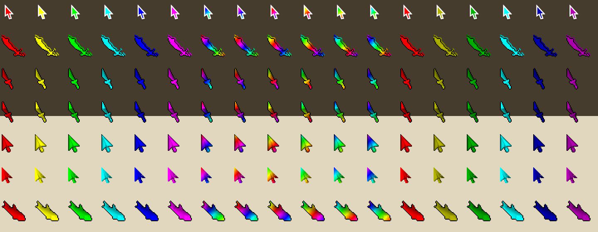

# RGB Cursor

Give your mouse an animated RGB look in RuneLite.

## Features

- **Color cursor**: a clean arrow (sized like the macOS pointer) that cycles through the rainbow, with a white or black border.
- **Shapes**: recolor 95 item cursors too: the classic Custom Cursor shapes (dragon scimitar, dragon dagger, dragon dagger (p), RS3 gold/silver, trout) plus 89 more, including partyhats, skillcapes, Barrows gear, godswords, whips and staves.
- **Effects**: Rainbow cycle, Gradient wave, or Breathing rainbow, with adjustable cycle time and saturation.
- **Mouse trail**: a fading rainbow trail behind the mouse that stays in sync with the cursor colors. Length, width and rainbow spread are adjustable.

## Notes

- Turn off RuneLite's built-in **Custom Cursor** plugin while using this; both set the mouse cursor.
- The cursor is crisp on HiDPI/Retina screens.

## Credits

The extra item cursors come from the community collection shared by [Nick2bad4u](https://github.com/Nick2bad4u) in [runelite/runelite discussion #16472](https://github.com/runelite/runelite/discussions/16472). They were converted from Windows `.cur` files to PNG, keeping each cursor's original click point.
